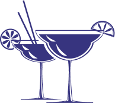

<div align="center">
  <h1 style="font-family: cursive;">The Fizzy Sipper</h1>
  
  <p> 
    A cocktail recommender application scaffolded with Create React App, built with React, react-query, Typescript and TailwindCSS. Testing was done with Jest and MirageJS.
    Cocktail data retrieved from https://www.thecocktaildb.com/api.php public API.
  </p>
</div>


### Deployment preview
Live preview available at:
https://the-fizzy-sipper.vercel.app

### Up and running

Install dependencies
```bash
yarn
```
Run development server
```
yarn start
```
Run tests
```
yarn test
```
